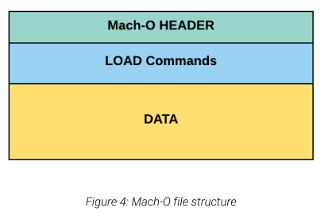

# Mach O Format


# Dreft
## What is ABI?
ABI (Application Binary Interface) defines the layout and structure of an executable binary, guiding how the compiler generates machine code, how the linker arranges and connects object files, and how the loader maps the final binary into memory and prepares it for execution.

## About Mach-o
`Mach-O` is an ABI for Mac OS Apple Computers ...
It's structed in 
- File Header. 
- load_Commands and it has many types such as Segments, Sections and so on... 


### Universal Binaries FAT format from OSMR EXP-312 
Mach-o could contines multiple Mach-o File each one has difference architucters like X86, ARM and so one... and it's known as Fat files.

> xnu-7195.50.7.100.1/EXTERNAL_HEADERS/mach-o/fat.h
```c 
#define FAT_MAGIC 0xcafebabe
#define FAT_CIGAM 0xbebafeca /* NXSwapLong(FAT_MAGIC) */

typedef cpu_type_t int
typedef cpu_subtype_t int

struct fat_header {
    uint32_t magic; /* FAT_MAGIC */
    uint32_t nfat_arch; /* number of structs that follow */
};

struct fat_arch {
    cpu_type_t cputype; /* cpu specifier (int) */
    cpu_subtype_t cpusubtype; /* machine specifier (int) */
    uint32_t offset; /* file offset to this object file */
    uint32_t size; /* size of this object file */
    uint32_t align; /* alignment as a power of 2 */
};
```

### Mach-O Structure from OSMR EXP-312
Mach-O files consist of three main parts, as shown below.
<!--  -->
- The `header` contains basic metadata about the file. For example, it may contain platform information.
- The `load commands` contain instructions on how to map the binary into memory.
- The `data` part holds the actual binary data that will be mapped to memory, like program code, and variables.

#### Mach-O Header from OSMR EXP-312

> xnu-7195.50.7.100.1/EXTERNAL_HEADERS/mach-o/loader.h.
```c 
/* Constant for the magic field of the mach_header (32-bit architectures) */
#define MH_MAGIC 0xfeedface /* the mach magic number */
#define MH_CIGAM 0xcefaedfe /* NXSwapInt(MH_MAGIC) */

/* Constant for the magic field of the mach_header_64 (64-bit architectures) */
#define MH_MAGIC_64 0xfeedfacf /* the 64-bit mach magic number */
#define MH_CIGAM_64 0xcffaedfe /* NXSwapInt(MH_MAGIC_64) */

typedef cpu_type_t int
typedef cpu_subtype_t int

struct mach_header {
    uint32_t        magic;                 /* mach magic number identifier */
    cpu_type_t      cputype;               /* cpu specifier */
    cpu_subtype_t   cpusubtype;            /* machine specifier */
    uint32_t        filetype;              /* type of file */
    uint32_t        ncmds;                 /* number of load commands */
    uint32_t        sizeofcmds;            /* the size of all the load commands */
    uint32_t        flags;                 /* flags */
};

struct mach_header_64 {
    uint32_t        magic;                 /* mach magic number identifier */
    cpu_type_t      cputype;               /* cpu specifier */
    cpu_subtype_t   cpusubtype;            /* machine specifier */
    uint32_t        filetype;              /* type of file */
    uint32_t        ncmds;                 /* number of load commands */
    uint32_t        sizeofcmds;            /* the size of all the load commands */
    uint32_t        flags;                 /* flags */
    uint32_t        reserved;              /* reserved */
};
```

#### Mach-O Load Command from OSMR EXP-312

Load commands are structures that describe how to load different parts of the executable into memory.
The various load commands have different structures, but each one begins with the same eight bytes, which define the type of command, and the total size of the command (in bytes).

> xnu-7195.50.7.100.1/EXTERNAL_HEADERS/mach-o/loader.h
```c 
struct load_command {
    uint32_t cmd;       /* type of load command */
    uint32_t cmdsize;   /* total size of command in bytes */
};
```


`LC_SEGMENT_64` (or `LC_SEGMENT` for x86 architecture) defines a segment that will be mapped
into the process’s memory space. The segment might be a `__TEXT` segment, which contains the
executable code, or a `__DATA` segment, which contains data for the process.

All segments can be found in the data portion of the Mach-O file. Each segment contains multiple sections, and the load command structure will contain information about each section inside the segment. The section information will directly follow the `LC_SEGMENT_64` command.

> xnu-7195.50.7.100.1/EXTERNAL_HEADERS/mach-o/loader.h
```c 
struct segment_command_64 { /* for 64-bit architectures */
    uint32_t    cmd;           /* LC_SEGMENT_64 */
    uint32_t    cmdsize;       /* includes sizeof section_64 structs */
    char        segname[16];   /* segment name */
    uint64_t    vmaddr;        /* memory address of this segment */
    uint64_t    vmsize;        /* memory size of this segment */
    uint64_t    fileoff;       /* file offset of this segment */
    uint64_t    filesize;      /* amount to map from the file */
    vm_prot_t   maxprot;       /* maximum VM protection */
    vm_prot_t   initprot;      /* initial VM protection */
    uint32_t    nsects;        /* number of sections in segment */
    uint32_t    flags;         /* flags */
};
```


The `LC_SEGMENT_64` command defines the number of sections in the `nsects` member.

> xnu-7195.50.7.100.1/EXTERNAL_HEADERS/mach-o/loader.h
```c 
struct section_64 { /* for 64-bit architectures */
    char sectname[16];          /* name of this section */
    char segname[16];           /* segment this section goes in */
    uint64_t addr;              /* memory address of this section */
    uint64_t size;              /* size in bytes of this section */
    uint32_t offset;            /* file offset of this section */
    uint32_t align;             /* section alignment (power of 2) */
    uint32_t reloff;            /* file offset of relocation entries */
    uint32_t nreloc;            /* number of relocation entries */
    uint32_t flags;             /* flags (section type and attributes)*/
    uint32_t reserved1;         /* reserved (for offset or index) */ 
    uint32_t reserved2;         /* reserved (for count or sizeof) */ 
    uint32_t reserved3;         /* reserved */
};
```


- The `LC_LOAD_DYLINKER` load command contains the path to the dynamic linker executable that maps shared libraries into the process address space. The value is always set to `/usr/lib/dyld`. It’s important to note that in macOS, dylib mapping happens in user mode, not in kernel mode.
- The `LC_MAIN` load command specifies the entry point for the executable. This is where the program starts executing once the Mach-O file is loaded in memory.
- The `LC_LOAD_DYLIB` is a load command that contains information about which libraries should be loaded by `dyld`, the dynamic loader.
- The `LC_CODE_SIGNATURE` load command contains information about the code signature of the Macho-O file. It only contains an offset that points to the signature blob. This is typically at the very end of the file.


#### Mach-O Data from OSMR EXP-312 1.3.5 
- The data part will contain all the segments as well as other information. 
- This includes a function table, which holds information about the program functions. 
- It also has a place for the symbol table, which contains information about the external function used by the binary and potentially internal function or variable names as well.

##### Naming convention of segments and sections
- The naming convention of segments starts with two underscores (`__`) and is capitalized, while sections start with two underscores and are lowercase. There are plenty of section types, but only a few possible segment names.
- The `__PAGEZERO` segment is significant. It instructs the kernel to map the zero page with memory protection flags completely cleared out, which means that address zero will be mapped and reserved in each process. Note that this memory page cannot be read from, written to, or executed. The maxprot and minprot variables in the structure are set to zero to indicate there are no read-write-execute rights on this page. This allocation is important to mitigate `NULL` pointer dereference vulnerabilities.
- The `__TEXT` segment contains the majority of the app. The `__text` section contains the executable code. `__stubs` and `__stubs_helper` are involved during the dynamic library loading process, and the `__cstring` section holds C string literals.
- The `__DATA` segment holds the actual program data. The `__data` section holds initialized mutable variable data and the `__bss` holds uninitialized static variables.


## Demo:
## Tools we could use to see the type of the file...
- `file`
- `otool`
- `MachOView`


## Resources
[OS X ABI Macho file format reference](https://github.com/aidansteele/osx-abi-macho-file-format-reference)
[Exploring mach-o-part-1](https://gpanders.com/blog/exploring-mach-o-part-1/)
[Mach-o Structure](https://oliviagallucci.com/the-anatomy-of-a-mach-o-structure-code-signing-and-pac/)
[Mac OS X and iOS Internals: CHAPTER: 4 , Page: 91](https://newosxbook.com/MOXiI.pdf)
[OSMR EXP-312: 1.3 The Mach-O File Format]()

